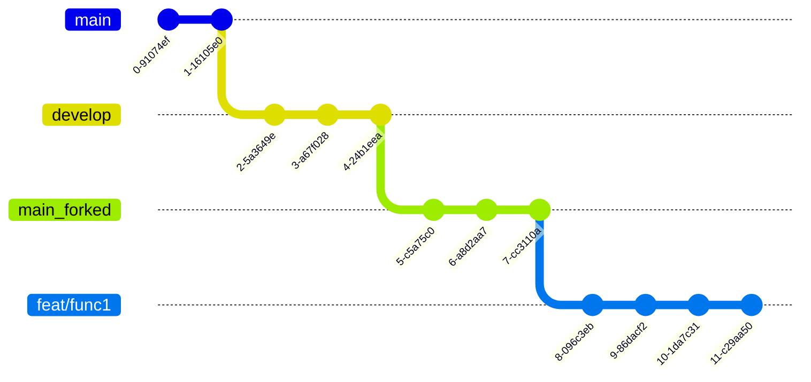

# 여행에 즐거움을 더하다 **triPlus** ✈️

**[배포 URL]**

- URL:

**[계정]**

- 🧑🏻‍💻 id:
- 🔐 password:

<!-- 이미지 -->

- 여기에 이미지 삽입

<br>

## 1. 소개 👥

- ✈️triPlus는 다양한 사용자들의 **폭넓은 여행 후기** 및 **자신의 여행 상품을 홍보**할 수 있는 **SNS서비스**입니다.

- 여행의 재미를 더하자는 취지에서 `'trip` 과`'plus'`라는 두 단어의 합성어로 서비스명을 정했습니다.

- 사용자는 사진을 통해 여행 후기를 공유할 수 있으며, 다른 사용자와 **좋아요** 및 **댓글**을 주고 받을 수 있습니다.

- 다른 사용자들과의 **팔로우**를 통해 자유로운 댓글 작성 및 홈 피드를 공유할 수 있습니다.

## 🙋‍♀️ triPlus 구성원 🙋‍♂️

|                                               **김대엽**                                                |                                                                         **문승규**                                                                         |                                                                   **방지영**                                                                   |                                                                                         **서정연**                                                                                         |
| :-----------------------------------------------------------------------------------------------------: | :--------------------------------------------------------------------------------------------------------------------------------------------------------: | :--------------------------------------------------------------------------------------------------------------------------------------------: | :----------------------------------------------------------------------------------------------------------------------------------------------------------------------------------------: |
|  |  |  |  |
|      [**GitHub**](https://github.com/kimdaeyeobbb) <br>[**blog**](https://blog.naver.com/kimdyk1)       |                                                        [**GitHub**](https://github.com/munseunggyu)                                                        |                                                   [**GitHub**](https://github.com/marrron/)                                                    |                                                                         [**GitHub**](https://github.com/yeon1128)                                                                          |

<br>

## 2. 개발 일정 📆

#### 기간 : 2022.12.09(금) ~ 2023.01.04(수)

<br>

## 3. 개발 환경 및 회의록🔗

**[개발 환경]**

- Front-End: React, Styled-components
- Back-End: 제공된 API 사용
- 디자인 도구: [🎨Figma](https://www.figma.com/file/Qcxn5LaToq0uhbrvZeHwl8/Untitled?t=254MQgkNmEv6hDyF-0)

### 기술 스택 선정 이유

- ㅁ

<br>

**[회의록 및 진행상황 공유]**

- 프로젝트 회의 : 매주 월,목 오전9시
- 📚 회의록: [GitHub-Wiki](https://github.com/9ivot/triplus/wiki)
- 🔖 프로젝트 진행상황: [GitHub-Projects](https://github.com/orgs/9ivot/projects/1)

<br>

## 4. 개발 규칙 🤙🏻

### 개발 규칙 선정 이유

- 팀원간의 의사소통 비용을 줄이기 위해서 선정하였습니다

### ❗ 커밋 컨벤션

```plain text
type: short summary

# type: 커밋 타입
# short summary: 커밋에 대한 간단한 설명
```

- 예시

```bash
feat: 라이트 모드 기능 추가
```

#### 커밋 타입

| 커밋     | 타입 설명                                                                                        |
| :------- | :----------------------------------------------------------------------------------------------- |
| docs     | 문서 수정(md 파일 등)                                                                            |
| feat     | 새로운 기능 추가                                                                                 |
| style    | 스타일 변경 (포매팅 수정, 들어쓰기 추가, 빈칸 제거, 스펠링 오류 등)                              |
| refactor | 리팩토링 작업(코드 동작은 유지하되, 코드의 가독성 및 유지보수성을 향상시키기 위한 내부구조 변경) |
| fix      | 버그 수정                                                                                        |
| revert   | 커밋 취소(reset 사용금지)                                                                        |
| test     | 테스트 코드 추가, 기존 테스트 수정                                                               |
| build    | 빌드 관련 파일 수정 (패키지 매니저 설정등 개발코드와 무관한 부분)                                |

<br>

#### 커밋 설명 규칙

- 명령조의 현재시제를 사용한다 (과거형이나 3인칭 사용X)
  - changed(x), changes(x)
  - change(o)
- 첫 글자는 항상 소문자로 기재한다
- 마침표를 찍지 않는다
- 커밋 메시지의 각 줄은 50자를 넘기지 않는다

<br>

### 🔃 Branch 전략



- main repo > main branch: 배포용
- main repo > develop branch: 개발용 (여기서 개발완료시 main repo의 main branch로 PR하여 배포)
- forked repo > main branch
- forked repo > feat/func1 : 기능별 구현시 main repo의 develop branch로 PR
- 기능별 구현을 할때마다 PR (커밋을 모아서 PR하기를 권장)

<!-- ## 5. 프로젝트 구조 🗂 -->

<!-- 폴더 구조를 좀 정리해서 마지막에 싹 넣으면 좋을 것 같습니다. -->

```bash
├─ .env
├─ .github
│  ├─ ISSUE_TEMPLATE
│  │  └─ 개인-주차별-작업내용-템플릿.md
│  └─ pull_request_template.md
├─ .gitignore
├─ README.md
├─ package-lock.json
├─ package.json
├─ public
│  ├─ favicon.ico
│  └─ index.html
└─ src
   ├─ App.jsx
   ├─ assets
   │  └─ images
   │     ├─ circle.svg
   │     ├─ css_sprites.png
   │     ├─ error_404.svg
   │     ├─ file_gray.svg
   │     ├─ loading.png
   │     ├─ main_logo.svg
   │     ├─ more_vertical.png
   │     ├─ plain_blue.svg
   │     ├─ plain_white.svg
   │     ├─ upload_file.svg
   │     ├─ user_img_big.svg
   │     ├─ user_img_small.svg
   │     └─ x.png
   ├─ components
   │  ├─ Button
   │  │  ├─ FollowBtn
   │  │  │  ├─ IsFollowButton.jsx
   │  │  │  └─ style.js
   │  │  ├─ LongBtn.jsx
   │  │  ├─ MiddleSmallBtn
   │  │  │  └─ MiddleSmallBtn.jsx
   │  │  └─ SaveBtn
   │  │     ├─ index.jsx
   │  │     └─ style.js
   │  ├─ CommentBar
   │  │  ├─ index.jsx
   │  │  └─ style.js
   │  ├─ Header
   │  │  ├─ HeaderTitle.jsx
   │  │  ├─ Prev.jsx
   │  │  ├─ SearchButton.jsx
   │  │  ├─ SearchInput.jsx
   │  │  ├─ Vertical.jsx
   │  │  ├─ index.jsx
   │  │  └─ style.js
   │  ├─ ImageBox
   │  │  └─ index.jsx
   │  ├─ InputBox
   │  │  └─ index.jsx
   │  ├─ MainContainer.js
   │  ├─ Modal
   │  │  ├─ AlertModal.jsx
   │  │  ├─ ModalContainer.jsx
   │  │  ├─ ModalList.jsx
   │  │  └─ style.js
   │  ├─ Navbar
   │  │  ├─ index.jsx
   │  │  └─ style.js
   │  ├─ PostCard
   │  │  ├─ PostCardBtns.jsx
   │  │  ├─ index.jsx
   │  │  └─ style.js
   │  └─ UserInfo
   │     ├─ index.jsx
   │     └─ style.js
   ├─ hooks
   │  ├─ useFollowBtn.js
   │  ├─ useGetData.js
   │  ├─ useGetPreview.js
   │  ├─ useHeartBtn.js
   │  ├─ useModal.js
   │  ├─ useObserver.js
   │  ├─ usePostUpload.js
   │  └─ useReloadData.js
   ├─ index.jsx
   ├─ pages
   │  ├─ ChatList
   │  │  ├─ ChattingList.jsx
   │  │  ├─ index.jsx
   │  │  └─ style.js
   │  ├─ ChatRoom
   │  │  ├─ ChatBar.jsx
   │  │  ├─ ChatHeader.jsx
   │  │  ├─ ChatReceive.jsx
   │  │  ├─ ChatSend.jsx
   │  │  ├─ ChatVertical.js
   │  │  ├─ Chattings.jsx
   │  │  ├─ index.jsx
   │  │  └─ style.js
   │  ├─ EmailLogin
   │  │  └─ index.jsx
   │  ├─ EmailSignUp
   │  │  └─ index.jsx
   │  ├─ ErrorPage
   │  │  ├─ index.jsx
   │  │  └─ style.js
   │  ├─ Follow
   │  │  ├─ index.jsx
   │  │  └─ style.js
   │  ├─ Home
   │  │  ├─ HomeNoFollow.jsx
   │  │  ├─ index.jsx
   │  │  └─ style.js
   │  ├─ LoadingPage
   │  │  ├─ index.jsx
   │  │  └─ style.js
   │  ├─ MultiLogin
   │  │  ├─ JoinLink.jsx
   │  │  ├─ LoginModal.jsx
   │  │  ├─ SocialLoginItem.jsx
   │  │  └─ index.jsx
   │  ├─ MyProfileAddProduct
   │  │  └─ index.jsx
   │  ├─ MyProfileEdit
   │  │  └─ index.jsx
   │  ├─ PostDetail
   │  │  ├─ Comment.jsx
   │  │  ├─ UserPostDetail.jsx
   │  │  ├─ index.jsx
   │  │  └─ style.js
   │  ├─ PostUpload
   │  │  ├─ PreviewList.jsx
   │  │  ├─ index.jsx
   │  │  └─ style.js
   │  ├─ ProductUpload
   │  │  ├─ index.jsx
   │  │  └─ style.js
   │  ├─ Profile
   │  │  ├─ BottomSection.jsx
   │  │  ├─ MidSection.jsx
   │  │  ├─ TopSection.jsx
   │  │  ├─ TopSectionMy.jsx
   │  │  ├─ TopSectionYour.jsx
   │  │  ├─ index.jsx
   │  │  └─ style.js
   │  ├─ Search
   │  │  ├─ index.jsx
   │  │  └─ style.js
   │  ├─ SetProfile
   │  │  └─ index.jsx
   │  └─ SplashScreen
   │     ├─ index.jsx
   │     └─ splashEvent.jsx
   ├─ theme.js
   └─ utils
      ├─ handleCommentTime.js
      ├─ handleDeclaration.js
      └─ handleDelete.js
```

<br>

## 6. 역할 분담 👨‍👩‍👧‍👧

### 🧑🏻‍💻김대엽

- splash 페이지, 로그인 페이지, 상대방 프로필 페이지
- 게시글 컴포넌트, 프로필 카드 컴포넌트

### 🧑🏻‍💻문승규

- axios 모듈화, 커스텀 라우터 개발
- 상단 네브바 컴포넌트, 판매중인 상품 컴포넌트, 팝업 모달 컴포넌트
- 회원가입 페이지, 프로필 페이지, 프로필 수정 페이지, 팔로잉/팔로우 페이지, 상품등록 페이지, 상품수정 페이지, 게시글 업로드 페이지

### 👩🏻‍💻방지영

- 메인 피드 페이지, 검색 페이지
- 프로필 이미지 컴포넌트, 하단 네브바 컴포넌트
- 디자인 기획 및 에셋 제작

### 👩🏻‍💻서정연

- 이메일 회원가입 페이지, 게시글 업로드 페이지, 게시글 상세 페이지
- 슬라이드 모달 컴포넌트, 버튼 컴포넌트, 댓글 컴포넌트
- 디자인 기획 및 에셋 제작

<br>

## 7. 구현 기능 🛠

### 7-1. 홈

<table>
    <tbody>
        <tr></tr>
        <tr>
            <th>시연</th>
            <th>설명</th>
        </tr>
        <tr>
            <td></td>
            <td>스플래쉬<ul>
                    <li>시작하기 버튼을 통해 서비스에 접속할 수 있습니다.</li>
                    <li>로그인: 메인 게시판으로 이동</li>
                    <li>비로그인: 로그인화면으로 이동</li>
                </ul>
            </td>
        </tr>
        <tr>
            <td></td>
            <td>회원가입<ul>
                    <li>시작하기 버튼을 통해 서비스에 접속할 수 있습니다.</li>
                    <li>로그인: 메인 게시판으로 이동</li>
                    <li>비로그인: 로그인화면으로 이동</li>
                </ul>
            </td>
        </tr>
        <tr>
            <td></td>
            <td>로그인 (multilogin)
                <ul>
                    <li>시작하기 버튼을 통해 서비스에 접속할 수 있습니다.</li>
                    <li>로그인: 메인 게시판으로 이동</li>
                    <li>비로그인: 로그인화면으로 이동</li>
                </ul>
            </td>
        </tr>
        <tr></tr>
        <tr>
            <td></td>
            <td>triPlus 피드<ul>
                    <li>유효성 검사를 진행하고, 오류 메시지를 제공합니다. </li>
                    <li>이메일과 비밀번호가 유효한 경우 게시판 화면으로 이동합니다.</li>
                </ul>
            </td>
        </tr>
        <tr></tr>
        <tr>
            <td></td>
            <td>회원가입<ul>
                    <li>사용자의 정보를 입력받아 회원가입을 진행합니다.</li>
                    <li>유효성 검사를 진행하고, 오류 메시지를 전달합니다.</li>
                    <li>모달창을 이용하여 커뮤니티 규칙과 개인정보 수집/이용 동의를 제공합니다.</li>
                </ul>
            </td>
        </tr>
    </tbody>
</table>
    
<br>
    
### 7-2. 검색 및 프로필
<table>
    <tbody>
        <tr></tr>
        <tr>
            <th>시연</th>
            <th>설명</th>
        </tr>
        <tr>
            <td></td>
            <td>검색<ul>
                    <li>인기/최신으로 게시글 정렬 순서를 변경할 수 있습니다.</li>
                    <li>드롭다운으로 카테고리를 지정할 수 있습니다.</li>
                    <li>이미지가 업로드 되지 않은 게시글은 카테고리별 기본 이미지를 제공합니다.</li>
                </ul>
            </td>
        </tr>
        <tr>
            <td></td>
            <td>팔로우 및 팔로잉<ul>
                    <li>인기/최신으로 게시글 정렬 순서를 변경할 수 있습니다.</li>
                    <li>드롭다운으로 카테고리를 지정할 수 있습니다.</li>
                    <li>이미지가 업로드 되지 않은 게시글은 카테고리별 기본 이미지를 제공합니다.</li>
                </ul>
            </td>
        </tr>
        <tr>
            <td></td>
            <td>상대방 프로필<ul>
                    <li>인기/최신으로 게시글 정렬 순서를 변경할 수 있습니다.</li>
                    <li>드롭다운으로 카테고리를 지정할 수 있습니다.</li>
                    <li>이미지가 업로드 되지 않은 게시글은 카테고리별 기본 이미지를 제공합니다.</li>
                </ul>
            </td>
        </tr>
        <tr>
            <td></td>
            <td>프로필 수정하기<ul>
                    <li>인기/최신으로 게시글 정렬 순서를 변경할 수 있습니다.</li>
                    <li>드롭다운으로 카테고리를 지정할 수 있습니다.</li>
                    <li>이미지가 업로드 되지 않은 게시글은 카테고리별 기본 이미지를 제공합니다.</li>
                </ul>
            </td>
        </tr>
    </tbody>
</table>
<br>

### 7-3. 게시글

<table>
    <tbody>
        <tr></tr>
        <tr>
            <th>시연</th>
            <th>설명</th>
        </tr>
        <tr>
            <td></td>
            <td>게시글 작성<ul>
                    <li>드롭다운 메뉴를 통해 게시글의 카테고리를 설정합니다.</li>
                    <li>첨부파일 선택 버튼을 이용하여 이미지를 업로드할 수 있습니다.</li>
                </ul>
            </td>
        </tr>
        <tr></tr>
        <tr>
            <td></td>
            <td>게시글 상세<ul>
                    <li>좋아요/스크랩이 가능하며, 댓글을 게시할 수 있습니다.</li>
                    <li>작성한 게시글에만 삭제 버튼이 활성화되어, 작성자만 삭제할 수 있습니다.</li>
                </ul>
            </td>
        </tr>
        <tr>
            <td></td>
            <td>게시글 수정<ul>
                    <li>드롭다운 메뉴를 통해 게시글의 카테고리를 설정합니다.</li>
                    <li>첨부파일 선택 버튼을 이용하여 이미지를 업로드할 수 있습니다.</li>
                </ul>
            </td>
        </tr>
        <tr>
            <td></td>
            <td>게시글 삭제<ul>
                    <li>드롭다운 메뉴를 통해 게시글의 카테고리를 설정합니다.</li>
                    <li>첨부파일 선택 버튼을 이용하여 이미지를 업로드할 수 있습니다.</li>
                </ul>
            </td>
        </tr>
         <tr>
            <td></td>
            <td>게시글 신고<ul>
                    <li>드롭다운 메뉴를 통해 게시글의 카테고리를 설정합니다.</li>
                    <li>첨부파일 선택 버튼을 이용하여 이미지를 업로드할 수 있습니다.</li>
                </ul>
            </td>
        </tr>
        <tr>
            <td></td>
            <td>좋아요<ul>
                    <li>드롭다운 메뉴를 통해 게시글의 카테고리를 설정합니다.</li>
                    <li>첨부파일 선택 버튼을 이용하여 이미지를 업로드할 수 있습니다.</li>
                </ul>
            </td>
        </tr>
    </tbody>
</table>
<br>

### 7-4. 상품

<table>
    <tbody>
        <tr></tr>
        <tr>
            <th>시연</th>
            <th>설명</th>
        </tr>
        <tr>
            <td></td>
            <td>상품 등록<ul>
                    <li>사용자의 프로필 정보를 제공합니다.</li>
                    <li>작성한 게시글, 좋아요, 스크랩한 게시글의 목록을 확인할 수 있습니다.</li>
                    <li>로그아웃을 할 수 있으며, 시작 페이지로 돌아갑니다.</li>
                </ul>
            </td>
        </tr>
        <tr></tr>
        <tr>
            <td></td>
            <td>상품 수정<ul>
                    <li>프로필 이미지를 변경하거나, 업로드한 이미지를 삭제할 수 있습니다.</li>
                    <li>새로운 닉네임의 중복 여부를 확인한 후 변경합니다.</li>
                </ul>
            </td>
        </tr>
         <tr>
            <td></td>
            <td>상품 삭제<ul>
                    <li>사용자의 프로필 정보를 제공합니다.</li>
                    <li>작성한 게시글, 좋아요, 스크랩한 게시글의 목록을 확인할 수 있습니다.</li>
                    <li>로그아웃을 할 수 있으며, 시작 페이지로 돌아갑니다.</li>
                </ul>
            </td>
        </tr>
    </tbody>
</table>

### 7-5. 댓글

<table>
    <tbody>
        <tr></tr>
        <tr>
            <th>시연</th>
            <th>설명</th>
        </tr>
        <tr>
            <td></td>
            <td>댓글 등록<ul>
                    <li>드롭다운 메뉴를 통해 게시글의 카테고리를 설정합니다.</li>
                    <li>첨부파일 선택 버튼을 이용하여 이미지를 업로드할 수 있습니다.</li>
                </ul>
            </td>
        </tr>
        <tr></tr>
        <tr>
            <td></td>
            <td>댓글 삭제<ul>
                    <li>좋아요/스크랩이 가능하며, 댓글을 게시할 수 있습니다.</li>
                    <li>작성한 게시글에만 삭제 버튼이 활성화되어, 작성자만 삭제할 수 있습니다.</li>
                </ul>
            </td>
        </tr>
        <tr>
            <td></td>
            <td>댓글 신고<ul>
                    <li>드롭다운 메뉴를 통해 게시글의 카테고리를 설정합니다.</li>
                    <li>첨부파일 선택 버튼을 이용하여 이미지를 업로드할 수 있습니다.</li>
                </ul>
            </td>
        </tr>
    </tbody>
</table>
<br>

<br>

## 8. 핵심 코드

### 커스텀 훅

#### 1) useObserver

기존에 페이지마다 useEffect를 이용해서 유저 정보를 확인했는데 이러한 중복코드가 발생해서 커스텀 라우터를 개발했습니다.

```js
useEffect(() => {
  const userInfo = JSON.parse(localStorage.getItem("userInfo"));
  const token = userInfo?.token;

  if (!token) {
    props.history.push("/login");
    return;
  }
}, []);
```

페이지에 들어올 때 유저정보가 존재하지않다면 로그인 화면으로 보낼 수 있도록 구현했습니다.

```jsx
export default function PrivateRoute({ children, ...rest }) {
  const userInfo = getUserInfo();

  return (
    <Route
      {...rest}
      render={(props) =>
        userInfo ? (
          React.cloneElement(children, { ...props })
        ) : (
          <Redirect
            to={{
              pathname: "/login",
              state: { from: props.location },
            }}
          />
        )
      }
    />
  );
}
```

커스텀 라우터를 사용할 때는 아래와 같이 사용할 수 있습니다.

```js
<PrivateRoute path="/profile" exact>
  <ProfilePage />
</PrivateRoute>
```

#### 2)

<br>

## 9. 팀원간 의견충돌 상황 및 해결책

### 1) 프로젝트 방향성 확립에 있어 어려움을 겪음

- 효과적인 의견 수렴을 위해 익명으로 [Google form](https://docs.google.com/forms/d/e/1FAIpQLSfrKCyi2O1YnpiMQO8_BcmLygXV78SG0ymc_cJKD6mtILj7mg/viewform)을 이용함

### 2) 기술선정에 있어 충돌 발생

- pure CSS vs styled-components

  -

- 커스텀 훅을 쓸지 api 를 모아 놓을 지 고민이 되었던 상황발생

  - api 구조가 비슷하기 때문에 useGetData 훅을 만들어서 url만 다르게 넣을 get 요청을 할 수 있도록 처리함

-

### 3) 의사소통에 있어 어려움을 겪음

- 의사소통 비용을 줄이기 위해서 템플릿 제작
  - git commit 커밋 템플릿
  - PR 템플릿
  - gitHub issue 템플릿
  - discord PR 알림 자동화

<br>

## 10. 트러블 슈팅

<br>

## 11. 추가 리팩토링

-
